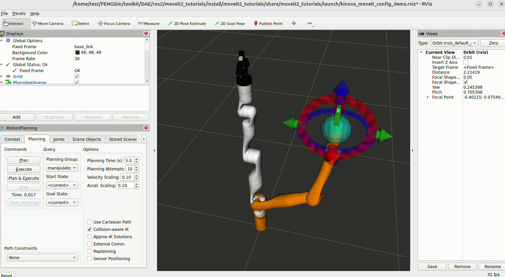

######################
ROS2/MoveIt2
######################

**********************
参考资料
**********************

ROS2的参考文献见 `<https://docs.ros.org/>`_ ，我们选择的版本为Jazzy，编译脚本的参考文献见 `<https://docs.ros.org/en/jazzy/>`_ ，在Installation中的Alternatives中的Ubuntu(Source)中有编译安装介绍，
install脚本是按照该介绍写的。MoveIt2的编译脚本的参考文献见 `<https://moveit.ai/install-moveit2/source/>`_ ，install脚本是按照该介绍写的。MoveIt2 Tutorials的编译脚本的参考文献见 `<https://github.com/moveit/moveit2_tutorials>`_ ，在MoveIt Tutorials Source Build中有编译安装介绍。

**********************
编译安装
**********************

按照如下操作在FENGSim中编译ROS2、MoveIt2和MoveIt2_Tutorials。

* 首先克隆FENGSim。 ::
  
    git clone https://github.com/OpenDigitalTwin-Dev/FENGSim.git

* 将DAE克隆到 ``FENGSim/toolkit`` 路径下。 ::
  
    cd FENGSim/toolkit
    git clone https://github.com/OpenDigitalTwin-Dev/DAE.git

* 在 ``FENGSim/toolkit/DAE/ros2/ros2/`` 中有一个install脚本，运行该脚本安装ROS2。 ::
  
    cd FENGSim/toolkit/DAE/ros2/ros2/
    ./install
    
* 在 ``FENGSim/toolkit/DAE/ros2/moveit2/`` 中有一个install脚本，运行该脚本安装MoveIt2。 ::
  
    cd FENGSim/toolkit/DAE/ros2/moveit2/
    ./install

* 在 ``FENGSim/toolkit/DAE/ros2/moveit2_tutorials/`` 中有一个install脚本，运行该脚本安装MoveIt2_Tutorials。 ::
  
    cd FENGSim/toolkit/DAE/ros2/moveit2_tutorials/
    ./install

ROS2、MoveIt2、MoveIt2_Tutorials要清楚三个环节，第一个是代码的获取，第二个是库依赖关系的配置和安装，第三个是编译和安装。其中代码获取采用了Vcstool去下载仓库，见 `<https://github.com/dirk-thomas/vcstool>`_ 。库依赖关系配置文件在rosdistro中，见 `<https://github.com/ros/rosdistro/tree/master>`_ ，本应该采用 ``rosdep init`` 创建配置文件，但由于 ``rosdep init`` 中会出现下载问题，
可以修改20-default.list和__init__.py中的路径，直接调用rosdistro中的配置文件。ROS2和MoveIt2除了依赖apt中的库，还有ros自己的包管理器中的库。
编译采用工具colcon，见 `<https://colcon.readthedocs.io/en/released/>`_ ，由于编译过程中也存在下载问题，因此如果出现异常结束，需要重复操作。

ROS2、MoveIt2、MoveIt2_Tutorials的源代码都在 ``src`` 目录下，编译安装后会生成  ``build`` ， ``install`` ， ``log`` 三个目录。
安装依赖库的命令为 ``rosdep install`` ，需要注意路径设置，例如： ::

  rosdep install --from-paths src --ignore-src -y --skip-keys "fastcdr rti-connext-dds-6.0.1 urdfdom_headers"

中指定了路径为 ``src`` 也就是源代码目录，会从源代码目录中寻找package.xml的依赖配置文件，再例如： ::

  rosdep install -r --from-paths . --ignore-src --rosdistro jazzy -y

中指定了当前路径，是因为在 ``src`` 路径下运行的该命令。编译的命令为 ``colcon build`` ，需要注意在 ``src`` 的上一层路径下执行该命令。例如： ::

  cd FENGSim/toolkit/DAE/ros2/ros2/ros2_jazzy
  colcon build --symlink-install

在 ``FENGSim/toolkit/DAE/ros2/ros2/ros2_jazzy/install`` ， ``FENGSim/toolkit/DAE/ros2/moveit2/ws_moveit2/install`` 和 ``FENGSim/toolkit/DAE/ros2/moveit2_tutorials/install`` 以及 ``/opt/ros/jazzy/`` 目录下有setup.bash文件配置环境变量，在使用ROS2、MoveIt2、MoveIt2_Tutorials之前运行以下命令。 ::

  cd FENGSim/toolkit/DAE/ros2
  source ros2/ros2_jazzy/install/setup.bash
  source moveit2/ws_moveit2/install/setup.bash
  source moveit2_tutorials/install/setup.bash

``/opt/ros/jazzy/`` 是在MoveIt2安装过程中产生的，在MoveIt2编译需要调用通过ros包管理器安装的一些库，因此需要运行以下命令配置环境变量，否则编译过程中会有一些ros链接库找不到。 ::

  source /opt/ros/jazzy/setup.bash
  
ROS2、MoveIt2、MoveIt2_Tutorials的编译安装可以在Docker中进行，运行 ``FENGSim/cli/`` 目录下的脚本程序test-docker-gui.sh，可以创建一个可以
打开图形用户界面的Docker容器，需要注意的是容器、终端或者电脑重启后，再进入容器可能会打不开图形用户界面，需要重复操作下test-docker-gui.sh中的以下几条命令。 ::
  
  sudo xhost +si:localuser:root
  sudo chmod 777 /tmp/.docker.xauth
  XAUTH=/tmp/.docker.xauth

**********************
算例测试
**********************

运行以下命令： ::

  cd FENGSim/toolkit/DAE/ros2
  source ros2/ros2_jazzy/install/setup.bash
  source moveit2/ws_moveit2/install/setup.bash
  source moveit2_tutorials/install/setup.bash
  ros2 launch moveit2_tutorials demo.launch.py

**********************
前后处理文件格式
**********************
