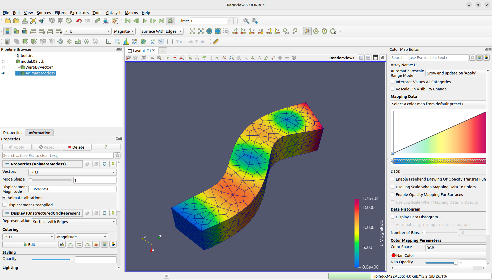
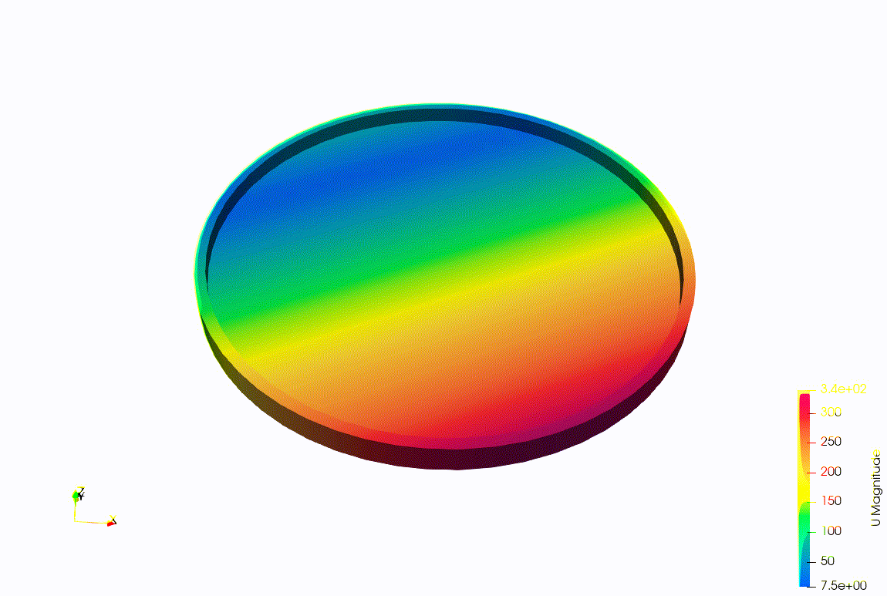
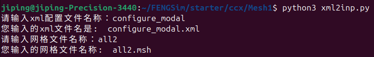
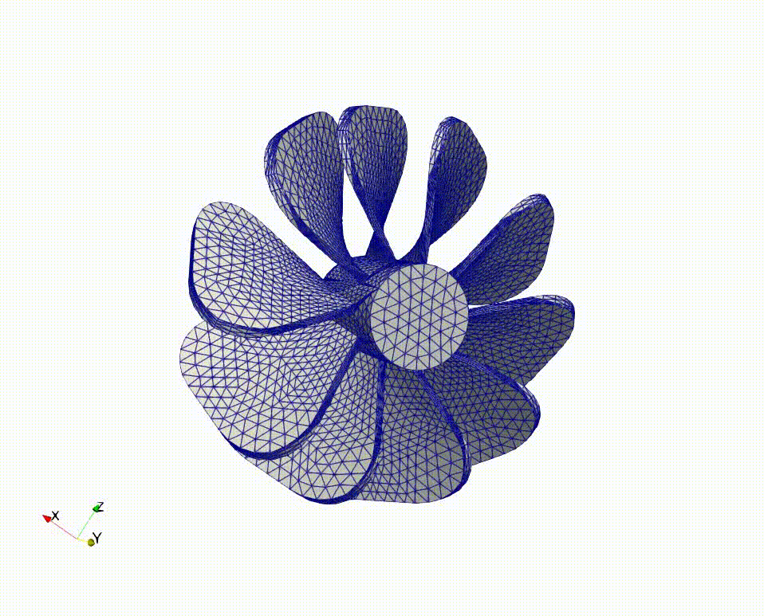
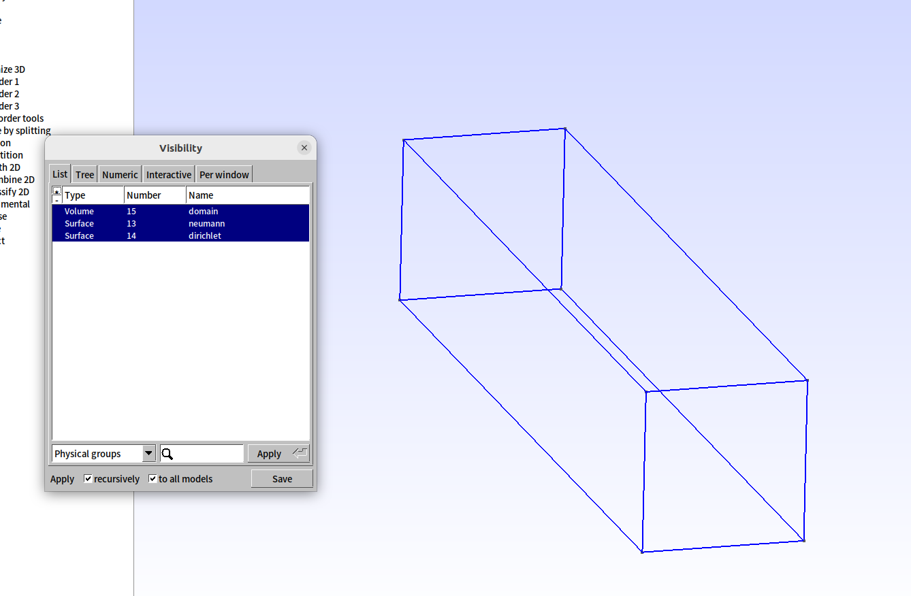
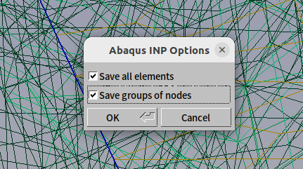
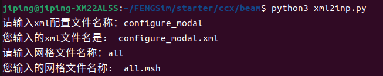
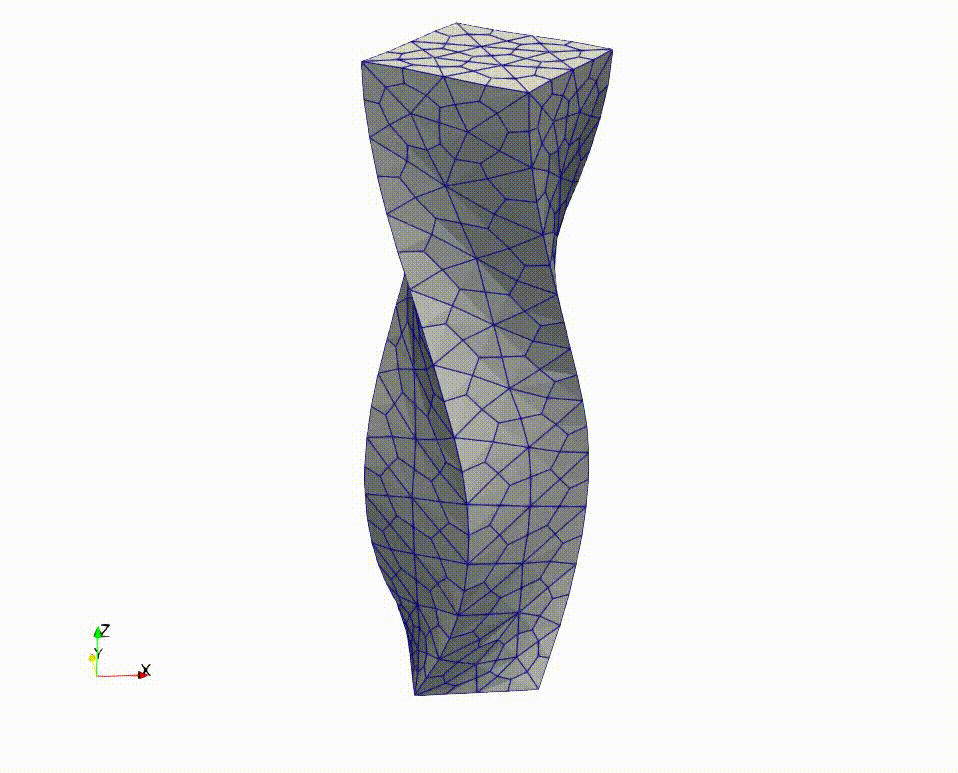

**********************
前后处理
**********************

==========================
Paraview查看模态动画
==========================

用Paraview也可以查看模态的动画，具体见VTK的AnimateModes类介绍如下，链接为 `<https://vtk.org/doc/nightly/html/classvtkAnimateModes.html>`_ 。 ::

  For certain file formats, like Exodus, simulation codes may use
  the timesteps and time values to represent quantities other than time.
  For example, for modal analysis, the natural frequency for each mode
  may be used as the time value. vtkAnimateModes can be used to reinterpret
  time as mode shapes. The filter can also animate vibrations for
  each mode shape (when AnimateVibrations is set to true).
  In that case, the time requested by the downstream pipeline is used to
  scale the displacement magnitude for a mode shape in a sinusoidal pattern,
  cos(2*pi * requested-time).

具体操作参考下图。

	   
首先用Paraview打开 ``FENGSim/starter/ccx/beam/`` 路径下的modal.08.vtk，
点击Pipeline Browser里的modal.08.vtk，点击WarpByVector的按钮，该按钮对应工具栏中发生变形的图标，
再点击Pipeline Browser里的modal.08.vtk，选择Filters里的Animate Modes。这里需要注意的是
点击WarpByVector和选择Animate Modes之前一定要先点击modal.08.vtk，modal.08.vtk是数据源，
其他操作是基于数据源操作，一定要先选择数据源。

其次点击Pipeline Browser里的WarpByVector1，在Properties中的Scale Factor进行刷新，
即点击最右侧两个箭头循环的按钮，刷新后Scale Factor显示3.051660754888145e-05，复制该数据。

最后点击Pipeline Browser里的AnimateModes1，将复制的3.051660754888145e-05粘贴到Properties中的
Displacement Magnitude里，同时取消下面的Displacement Preapplied。

+-----------------------------------------+-----------------------------------------+
| .. image:: fig/ccx/shape_8.gif          | .. image:: fig/ccx/modal.gif            |
|    :width: 350px                        |    :width: 350px                        |
+-----------------------------------------+-----------------------------------------+

	   
==========================
格式转换
==========================

--------------------
frd转vtk
--------------------

CalculiX前处理文件就是Abaqus的inp格式，后处理有一个python的模块，名字叫做ccx2paraview，可以将CalculiX自己的frd格式转成vtk或者vtu，在 ``FENGSim/toolkit/MultiX/extern/Calculix/ccx2paraview`` 目录下的README.md中有ccx2paraview的使用介绍，可以按照如下命令操作。 ::

  cd FENGSim/starter/ccx/Mesh1
  python3 ./../../../toolkit/MultiX/extern/Calculix/ccx2paraview/ccx2paraview.py modal.frd vtu
  python3 ./../../../toolkit/MultiX/extern/Calculix/ccx2paraview/ccx2paraview.py modal.frd vtk

--------------------
xml转inp
--------------------

在 ``FENGSim/starter/ccx/Mesh1`` 目录下有configure_modal.xml、all.msh、all2.msh、modal.inp、xml2inp.py。
all.msh和all2.msh是inp格式的网格文件，虽然后缀名是.msh，all.msh是由cgx生成的Mesh1算例的原始网格文件，all2.msh是gmsh生成的新例子的网格文件。
xml2inp.py提取configure_modal.xml中的数据，提取all.msh或者all2.msh中的数据，生成新的modal2.inp。这里需要注意的是gmsh导出all2.msh的时候，
all2.msh中包括了边、面、体的单元数据，要把边和面的单元数据去掉，之后和configure_modal.xml中配置数据合并成一个modal.inp。

xml2inp.py的运行结果如下图，文件名称不用输入后缀名。

-----------------------
带位移边界条件的xml转inp
-----------------------

上面例子是没有边界位移约束情况下的，如果添加位移约束，首先要在Gmsh中定义边界组，如下图，这里需要注意的是，即使不定义边界组，Gmsh导出.inp格式文件也会自动给单元集合命名。

	   
其次需要注意的是在Gmsh导出all.msh的时候，选择Save groups of nodes，如下图，因为边界位移约束是定义在结点集合上，如果不选择会导出不了结点集合。
   

xml2inp.py的运行结果如下图，文件名称不用输入后缀名。
configure_modal.xml是.xml格式配置文件，all.msh是Gmsh生成的.inp格式文件，xml2inp.py脚本程序将configure_modal.xml中配置内容转换成.inp格式同时合并all.msh中的网格数据，
生成modal.inp文件给CalculiX使用。

运行以下命令。 ::
  
  cd FENGSim/starter/ccx/beam
  mkdir Refs
  ./../../../toolkit/MultiX/extern/Calculix/bin/ccx_2.21 modal
  ./../../../toolkit/MultiX/extern/Calculix/bin/cgx -b shapes.fbl
  python3 ./../../../toolkit/MultiX/extern/Calculix/ccx2paraview/ccx2paraview.py modal.frd vtk

.. include:: oiltank.rst
