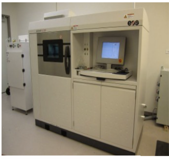

--------------------------------------------
算例测试
--------------------------------------------

^^^^^^^^^^^^^^^^^^^^^^^^^^^^^^^^^^^^^^^^^^^^
FDM（Fused Deposition Modeling）的例子
^^^^^^^^^^^^^^^^^^^^^^^^^^^^^^^^^^^^^^^^^^^^

采用CuraEngine 进行开发，FDM的例子主要针对
市面上通用的FDM 消费级3D打印设备进行，当前也有工业用的FDM设备大多是在消费级3D设备基础上进一步开发。
路径规划参照当前Cura中的相关例子实现相关路径规划功能（功能参见文档），路径后处理生成gcode（gcode代码介绍参见文档）

.. image:: fig/clipper/1.png
   :scale: 50 %
   :alt: alternate text
   :align: center

^^^^^^^^^^^^^^^^^^^^^^^^^^^^^^^^^^^^^^^^^^^^^^^^^^
激光选区融化SLM（Selective Laser Melting）例子
^^^^^^^^^^^^^^^^^^^^^^^^^^^^^^^^^^^^^^^^^^^^^^^^^^

（电子束也有选区融化的工艺跟激光选区融化相似，但是厂家非常少，咱们院有做过样机）

""""""""""""""""""""""""""""""""""""""""
激光选区熔化设备硬件介绍
""""""""""""""""""""""""""""""""""""""""

激光选区融化的路径规划与控制 主要针对以上设备，路径扫描相关控制主要包括振镜控制（进行平面扫描）、升降台与滚筒（或刮刀）控制，通过以上控制实现SLM 3D打印。
本例子振镜系统采用3D打印用f-θ聚焦扫描激光系统 ：采用德国SCANLAB公司的intelliSCAN 20(加装自动校准系统ASC) 及RTC4（2D）控制卡、德国LInos公司焦距f=420mm 的场镜、气动变焦扩束镜及保护镜片、瑞士RayTools公司的准直器，适配QBH输出的IPG 500W单模光纤激光器，如下面示意图组成 。

升降台与滚筒（或刮刀）控制采用PMAC控制卡

""""""""""""""""""""""""""""""""""""""""
激光选区熔化路径规划软件
""""""""""""""""""""""""""""""""""""""""

激光选区熔化路径规划实现功能

* 分区扫描：正方形分区、六角形分区。各分区扫描可自定顺序或者随机跳转
* 分区间隔或搭接设置、路径搭接设置、ZigZag扫描方向设置等

* 数模输入采用STL格式文档（文档格式说明见）、切片轮廓文件采用CLI存储（文档格式说明见）、最终切片加工路径文件采用AFF格式存储（AFF格式采用二进制存储占用空间小，文档格式说明见）
* 激光选区融化路径软件架构

RTC主要是实现激光振镜控制（开发说明文档见），PMAC卡主要实现升降台与滚筒或刮刀控制（开发说明文档见）。
（这块我做过控制软件有相关源代码C#和C++的可以整合进来）

^^^^^^^^^^^^^^^^^^^^^^^^^^^^^^^^^^^^^^^^^^^^^^^^^^
近净成形技术例子
^^^^^^^^^^^^^^^^^^^^^^^^^^^^^^^^^^^^^^^^^^^^^^^^^^
主要包括激光同轴送粉、电子束送丝、电弧送丝等

激光同轴送粉净近成型技术主要是采用六轴机器人进行3D打印控制，路径规划主要还是CuraEngine例子主要两种输出方式

* 路径规划模块直接对接ROS系统。
* 可直接输出KUKA机器人或者ABB或者史陶比尔机器人语言代码。（具体参考相关说明文档）

电子束送丝主要采用的机床进行3D打印控制，直接输出gcode代码
电弧送丝与激光同轴送粉相似主要采用机器人。
（这块做过路径规划以及后处理KUKA ABB机器人的，也可以对接ROS）

""""""""""""""""""""""""""""""""""""""""
3D路径规划
""""""""""""""""""""""""""""""""""""""""

激光同轴送粉、电子束送丝、电弧送丝等工艺也有相关3D的路径规划需求，以及增减材需求，这方面我以前都是对UG进行二次开发来进行。开源的应该有一些库可以试一下，看能不能做成例子。

	   
