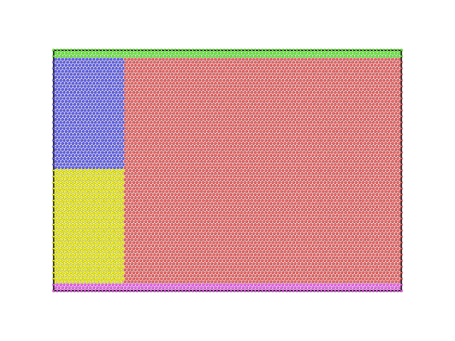

**********************
算例测试
**********************

LAMMPS提供了一系列示例案例帮助用户快速上手，参考 ``FENGSim/toolkit/Particles/lammps/examples`` 路径下 ``README`` 文件中的描述，您可以尝试一些简单的模拟任务，如裂纹扩展、流体流动、摩擦接触等。

按照如下操作，执行LAMMPS程序运行，计算并输出dump文件及图片。

.. code-block:: bash

   cd FENGSim/starter/lammps/crack
   export LD_LIBRARY_PATH=$PWD/../../../toolkit/Particles/install/lammps_install/lib
   ./../../../toolkit/Particles/install/lammps_install/bin/lmp < in.crack

可以用ovito打开结果文件dump.crack。

.. code-block:: bash

   ./../../../toolkit/MultiX/extern/Karamelo/ovito-basic-3.10.6-x86_64/bin/ovito
   

	    

