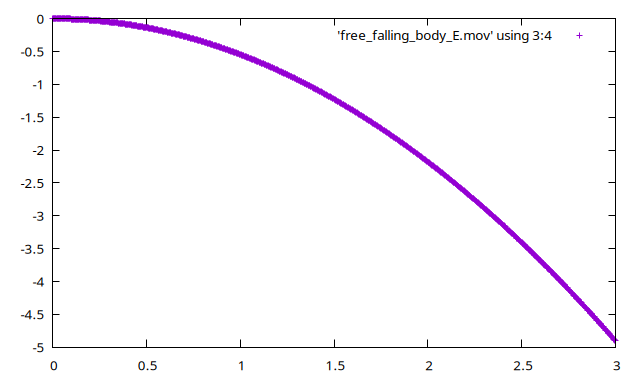

**********************
算例测试
**********************

在 ``FENGSim/starter/mbdyn/free_falling`` 目录下有一个自由落体的简单例子，运行如下命令。 ::
  
    cd FENGSim/starter/mbdyn/free_falling
    ./../../../toolkit/DAE/install/mbdyn_install/bin/mbdyn -f free_falling_body_E.mbd
    gnuplot
    plot 'free_falling_body_E.mov' using 3:4

