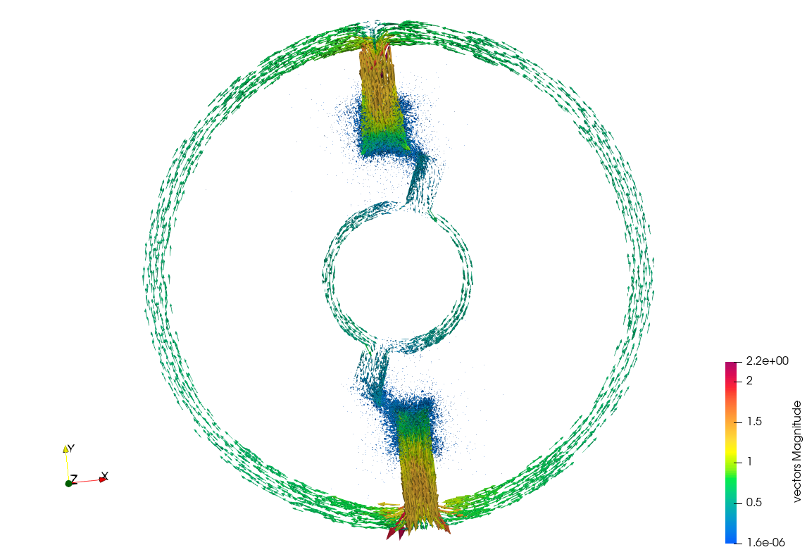
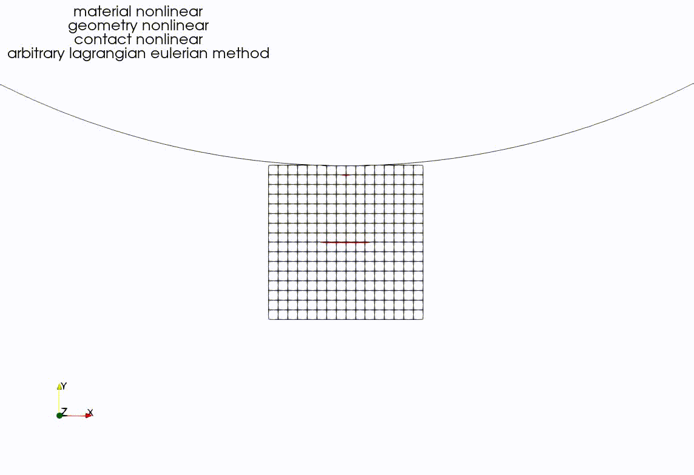

**********************
算例测试
**********************

按照如下命令运行算例。 ::

  cd FENGSim/starter/multix
  ./../../toolkit/MultiX/build/multix

用Paraview打开 ``FENGSim/starter/multix/data/vtk/`` 路径下的magnetostatics_nonlinear_domain.vtk，得到下图。

	   
