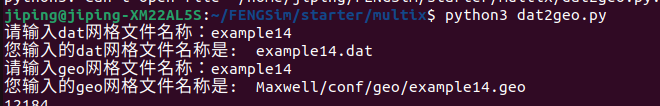
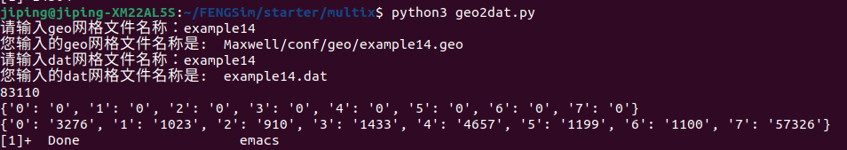

	   
**********************
前后处理
**********************

MultiX目前有两种配置文件，之后可以进一步合并，分别是.conf和.xml。
.xml保存在各个模块的 ``conf`` 路径下，例如 ``FENGSim/starter/multix/Maxwell/conf`` 路径下的 ``configure.xml`` 。
MultiX的网格文件格式是.geo，在 ``FENGSim/starter/multix`` 路径下的 ``dat2geo.py`` 和 ``geo2dat.py`` ，可以将.dat和.geo互相转换。

在静磁模块的 ``FENGSim/starter/multix/Maxwell/conf`` 路径下的 ``configure.xml`` 配置文件中比较重要的是定义线圈中的电流。
在线圈Geom属性中定义了几何尺寸，例如下面xml代码中的Geom一行，一共四个数值。
其中第一个数值和第二个数值如图中的Geom[0]和Geom[1]，
第三个数值和第四个数值是线圈横截面的长宽。线圈平面局部坐标系的位置以及x轴和y轴方向定义如图中a，b，p。

.. code-block:: xml

      <part_5>
	<Attributes>5</Attributes>
      	<CurrentIntensity>3000</CurrentIntensity>
	<Geom>0.015,0.015,0.020,0.017</Geom>
	<Position>0,0,0</Position>
	<DirectionA>1,0,0</DirectionA>
	<DirectionB>0,0,1</DirectionB>
      </part_5>

.. image:: fig/coil.png
   :scale: 50 %
   :alt: alternate text
   :align: center

	   
--------------------
dat转geo
--------------------

--------------------
geo转dat
--------------------

