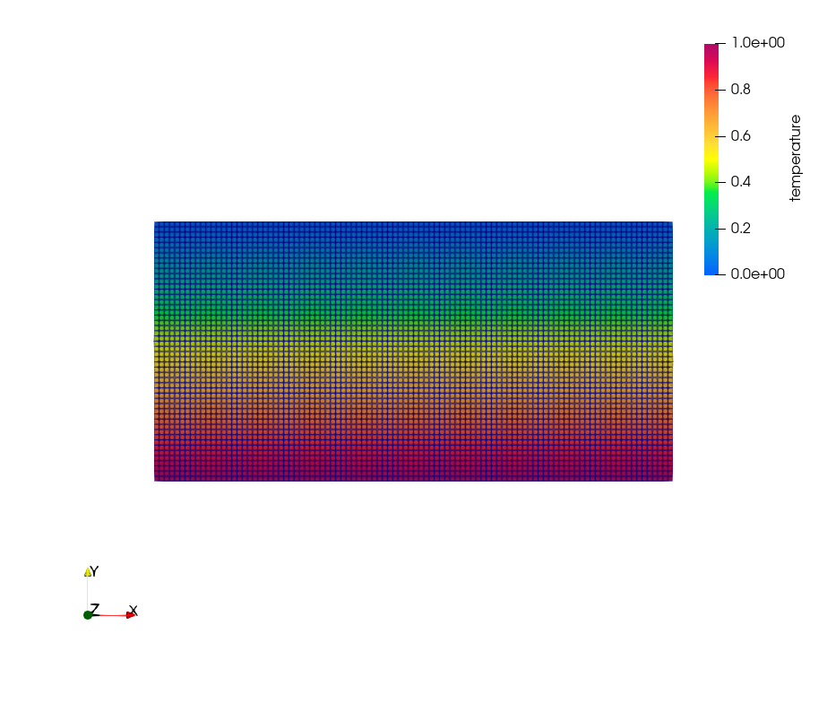
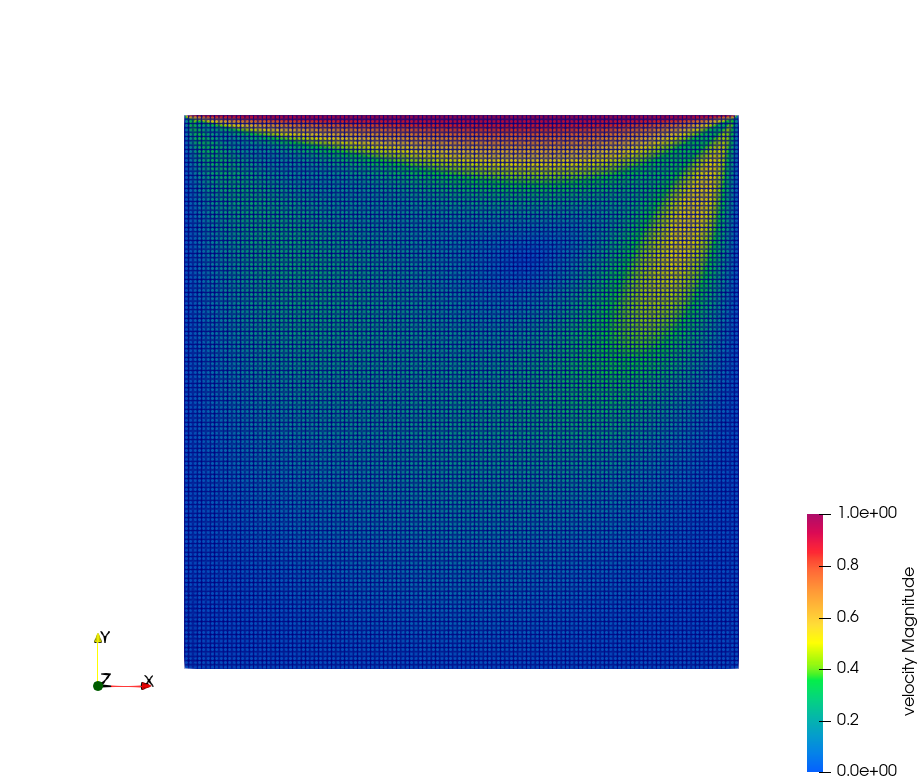

**********************
算例测试
**********************

对 ``FENGSim/starter/palabos/boussinesqThermal2d`` 路径下的 ``CMakeLists.txt``
里的Palabos路径进行了修改，并创建 ``tmp`` 目录。

.. code-block:: bash

   cd FENGSim/starter/palabos/boussinesqThermal2d
   ./install
   ./rayleighBenard2D 100
   

.. code-block:: bash

   cd FENGSim/starter/palabos/cavity2d
   ./install
   ./cavity2d
   

