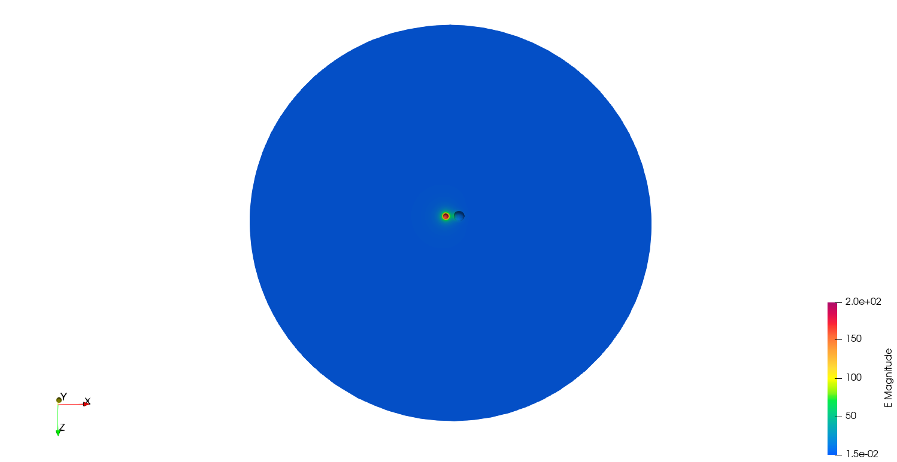

**********************
算例测试
**********************

======================
静电算例
======================

直接运行Palace可执行程序 ``FENGSim/toolkit/CEM/install/palace_install/bin/palace`` 会有第三方链接库路径问题，暂时换一种方法运行。
在 ``FENGSim/starter/palace/examples/`` 目录中保存了 ``FENGSim/toolkit/CEM/palace/examples/`` 目录下Palace自带的例子，例子介绍可见链接 `<https://awslabs.github.io/palace/dev/examples/examples/>`_ 。按照如下操作运行Capacitance Matrix for Two Spheres算例。 ::

  cd FENGSim/starter/palace/examples/spheres
  ./../../../../toolkit/CEM/palace/palace/build/palace-x86_64.bin spheres.json

用Paraview打开 ``FENGSim/starter/palace/examples/spheres/postpro/paraview/electrostatic/electrostatic.pvd`` ，如下图。

.. include:: stasticmag.rst

