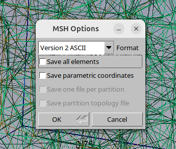
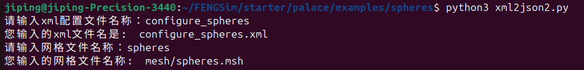

**********************
前后处理
**********************

Palace前后处理文件比较简单，网格剖分采用Gmsh，在 ``FENGSim/starter/palace/examples/spheres/mesh`` 目录下，mesh.jl文件是Gmsh网格剖分操作，通过Julia接口操作，spheres.msh是生成的网格文件。在 ``FENGSim/starter/palace/examples/spheres/`` 目录下spheres.json文件中定义了物理模型以及解法器。在 ``FENGSim/starter/palace/examples/spheres/postpro`` 目录下是生成的结果文件， ``FENGSim/starter/palace/examples/spheres/postpro/paraview`` 目录下是生成的vtk文件。

Palace原始例子中给的网格文件spheres.msh是高阶有限元用的，在 ``FENGSim/starter/palace/examples/spheres/`` 目录下有一个spheres.geo文件，这个文件是gmsh建模的脚本，可以用gmsh打开spheres.geo，然后剖分得到一阶有限元的网格文件spheres2.msh，保存到 ``FENGSim/starter/palace/examples/spheres/mesh`` 目录下。这里需要注意的是，用Gmsh图形用户界面导出.msh文件时候，会弹出如下图对话框，不要选中Save all elements，否则Physical Groups的编号无法导出到.msh文件中。

Gmsh的msh网格文件介绍可以在 `<https://web.mit.edu/gmsh_v3.0.1/gmsh.pdf>`_ 第9.1节找到，以spheres.msh为例介绍。 ::

  $MeshFormat
  2.2 0 8
  $EndMeshFormat
  $PhysicalNames
  4
  2 2 "farfield"
  2 3 "sphere_a"
  2 4 "sphere_b"
  3 1 "domain"
  $EndPhysicalNames
  $Nodes
  48882
  1 4.592425496802574e-15 -1.124819836996393e-30 75
  2 4.592425496802574e-15 -1.124819836996393e-30 -75
  3 -2.5 0 1
  4 -2.5 0 -1
  5 2.5 0 2
  6 2.5 0 -2
  .......
  $EndNodes
  $Elements
  11317
  1 21 2 2 1 2 234 225 295 296 297 298 299 300 301
  2 21 2 2 1 127 227 129 302 303 304 305 306 307 308
  3 21 2 2 1 175 213 184 309 310 311 312 313 314 315
  4 21 2 2 1 238 243 183 316 317 318 319 320 321 322
  .......
  437 21 2 3 2 2020 3 2093 2112 2113 2114 2115 2116 2117 2118
  438 21 2 3 2 2053 2078 2079 2119 2120 2121 2122 2123 2124 2125
  439 21 2 3 2 2078 2086 2102 2126 2127 2128 2129 2130 2131 2132
  440 21 2 3 2 2086 2075 2102 2133 2134 2135 2136 2129 2128 2137
  .......
  645 21 2 4 3 2961 2958 2997 3021 3022 3023 3024 3025 3026 3027
  646 21 2 4 3 2944 2941 2995 3028 3029 3030 3031 3032 3033 3034
  647 21 2 4 3 2946 2945 2977 3035 3036 3037 3038 3039 3040 3041
  648 21 2 4 3 2936 2945 2946 3042 3043 3036 3035 3044 3045 3046
  .......
  845 29 2 1 3 3805 3806 3807 3808 5287 5288 5289 5290 5291 5292 5293 5294 5295 5296 5297 5298 5299 5300 5301 5302
  846 29 2 1 3 3809 3810 3811 2992 5303 5304 5305 5306 5307 5308 5309 5310 5311 5312 5313 5314 5315 5316 5317 5318
  847 29 2 1 3 3812 3813 3814 3811 5319 5320 5321 5322 5323 5324 5325 5326 5327 5328 5329 5330 5331 5332 5333 5334
  848 29 2 1 3 3815 3816 3817 3818 5335 5336 5337 5338 5339 5340 5341 5342 5343 5344 5345 5346 5347 5348 5349 5350
  .......
  $EndElements

MeshFormat保持不变。PhysicalNames中定义了4个物理定义，其中3个边界和1个区域，首先给出物理定义个数为4，之后到结束关键字，第1列是维数，第2列是编号，例如farfield、sphere_a和sphere_b的维数是2，domain的维数是3。Elements中定义了边界面网格单元和体网格单元，首先给出单元个数为11317，之后到结束关键字，第2列是单元类型，例如21为10节点3阶三角形单元，29为20节点3阶四面体单元，可以在106页和107页找到，第4列对应了PhysicalNames中的编号，第5列为网格单元集合编号，集合编号按照点、线、面、实体分类编号，spheres.msh例子中有三个面，编号分别为1、2、3，有一个实体，编号为3。整个文件可以用Gmsh图形用户界面操作获得，需要选择保存成msh格式，再次选择Version 2 ASCII，目前Gmsh有新的网格格式Version 4 ASCII。

==========================
格式转换
==========================

--------------------
xml转json
--------------------

在 ``FENGSim/starter/palace/examples/spheres/`` 路径下有两个python脚本，分别是xml2json.py和xml2json2.py，
xml2json.py是原封不动将xml中字典格式转换为json，xml2json2.py是将xml中网格组名称去掉后转换为json。
运行xml2json2.py，会要求从命令行输入xml文件名称和网格文件名称，名称不用输入后缀名，网格文件默认保存在 ``FENGSim/starter/palace/examples/spheres/mesh`` 路径下，
运行结果如下图，并生成data3.json文件。

在 ``FENGSim/starter/palace/examples/spheres/`` 路径下有两个例子，
一个是原始Palace给的电容矩阵例子，xml和msh文件名称分别为configure_spheres.xml和spheres.msh，这个例子中用了Ground和Terminal的边界条件，
另外一个是自定义的例子，xml和msh文件名称分别为configure_ex_3d.xml和ex_3d.msh，这个例子中测试了Ground、Terminal、ZeroCharge三种边界条件。
这两个例子测试了xml2json2.py。

.. image:: fig/palace_3.png
   :scale: 50 %
   :alt: alternate text
   :align: center
