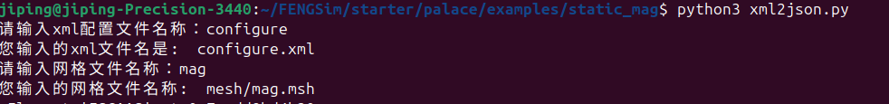

======================
静磁算例
======================

首先将.xml格式配置文件转为.json格式配置文件，如下图。

再按照如下操作运行静磁算例。 ::
  
  cd FENGSim/starter/palace/examples/static_mag
  ./../../../../toolkit/CEM/palace/palace/build/palace-x86_64.bin mag2.json

用paraview打开 ``FENGSim/starter/palace/examples/static_mag/postpro/paraview/magnetostatic/magnetostatic.pvd`` ，如下图。

+------------------------------------+------------------------------------+
| .. image:: fig/mag_2.png           | .. image:: fig/mag_1.png           |
|    :width: 350px                   |    :width: 350px                   |
+------------------------------------+------------------------------------+
