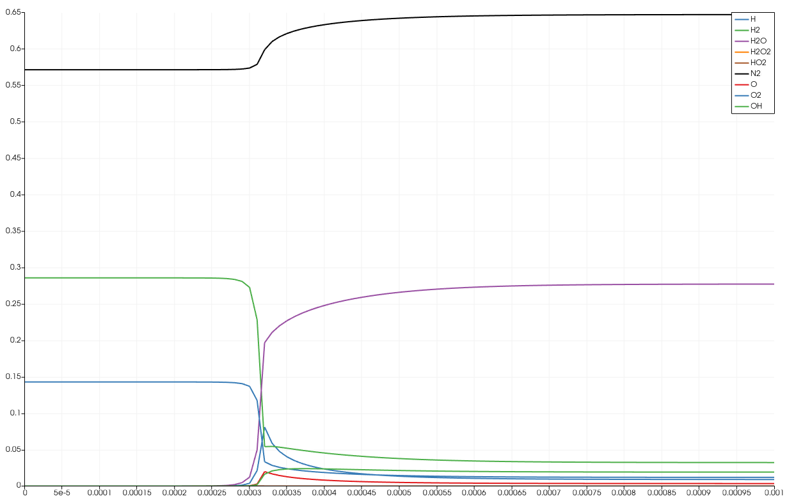

######################
Cantera
######################

**********************
参考资料
**********************

Cantera网站为　`<https://cantera.org/>`_　，其中有详细介绍。

**********************
编译安装
**********************

按照如下操作在FENGSim中编译安装Cantera。

* 首先克隆FENGSim。 ::
  
    git clone https://github.com/OpenDigitalTwin-Dev/FENGSim.git
  
* 再将DAE克隆到 ``FENGSim/toolkit`` 路径下。 ::
  
    cd FENGSim/toolkit
    git clone https://github.com/OpenDigitalTwin-Dev/DAE.git
  
* 在 ``FENGSim/toolkit/DAE/cantera`` 中有一个install脚本，直接运行该脚本可以在Ubuntu24.04下编译安装Cantera，无需其他操作。 ::
  
    cd FENGSim/toolkit/DAE/cantera
    ./install

Cantera安装在 ``FENGSim/toolkit/DAE/install/cantera_install`` 路径下。
    
**********************
算例测试
**********************

按照如下命令编译运行C++算例。 ::

  cd FENGSim/toolkit/DAE/install/cantera_install/share/cantera/samples/cxx/kinetics1/
  mkdir build
  cd build
  cmake ..
  make
  ./kinetics1

结果文件是kin1.csv，用Paraview打开，并用Filters里的Plot Data绘制结果图，点击结果图，将AR、Density、Pressure、Temperature、time取消，得到下图。

	   
**********************
前后处理文件格式
**********************
