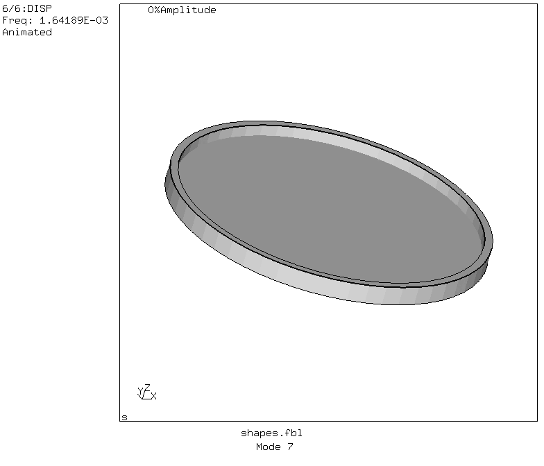
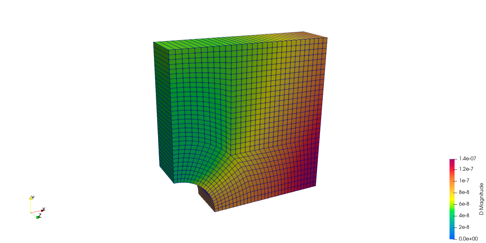
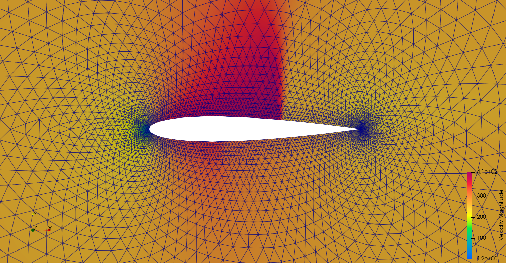
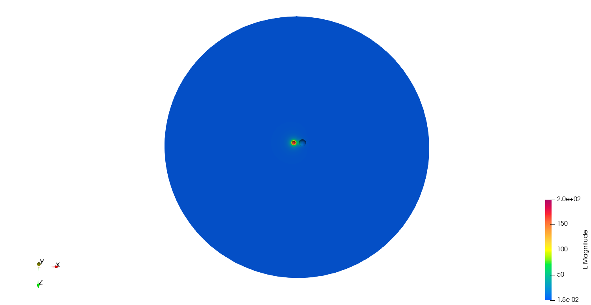
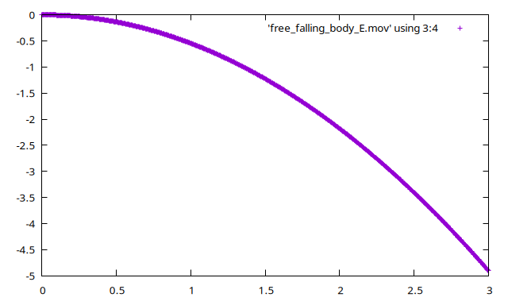
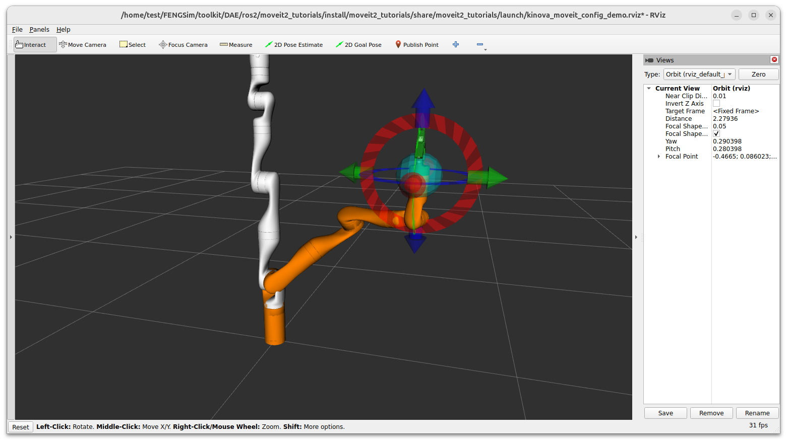

.. toctree::
   :maxdepth: 2

######################
FENGSim
######################

**********************
参考资料
**********************

**********************
编译安装
**********************

将FENGSim一次性部署在服务器上，供多个用户使用。采用Docker避免部署对宿主机的影响，在 ``FENGSim/cli`` 路径下有两个脚本，分别为test-docker.sh和test-docker-gui.sh，这两个脚本默认FENGSim保存在路径 ``$HOME/FENGSim`` 中，运行脚本都会建立Ubuntu24.04容器并进入，test-docker-gui.sh建立的容器可以运行图形用户界面。

之后在宿主机上按照如下命令建立Docker组，并添加成员。 ::
  
  sudo groupadd -f docker
  sudo usermod -aG docker user_name

不同用户就都可以使用同一容器了，容器名称为test。 ::

  sudo docker ps -a
  sudo docker start test
  sudo docker exec -it test /bin/bash

FENGSim直接部署在阿里云服务器或者Docker，如果是root账户，在编译和运行求解器时候会产生mpi报错，例如Palace编译中Petsc会产生mpi报错，mpirun命令也会报错，因此要采用非root账户，在Docker容器中也可以采用adduser命令创建新用户，然后用新用户登录容器。

可以在Docker中编译FENGSim前后处理软件，由于Docker中是极简操作系统，有些Qt需要的链接库可能没有，设置环境变量，export QT_DEBUG_PLUGINS=1，根据报错安装相应的链接库，然后可以从Docker打开FENGSim图形用户界面。

求解器可执行程序可以建立软链接到 ``/usr/local/bin`` 目录中，建立软链接时要注意源文件和链接文件路径要写详细，不要用相对路径。

**********************
算例测试
**********************

**********************
前后处理文件格式
**********************

######################
CCX
######################

**********************
参考资料
**********************

**********************
编译安装
**********************

**********************
算例测试
**********************

	   
**********************
前后处理文件格式
**********************

	      
######################
OpenFOAM
######################

**********************
参考资料
**********************

OpenFOAM的网站有两个，分别是 `<https://www.openfoam.com>`_ 和 `<https://openfoam.org>`_ ，推荐使用openfoam.org，www.openfoam.com国内打不开。
在openfoam.org网站的Download菜单中，可以选择Compiling Sources，其中有OpenFOAM详细的编译介绍，一共分为5步。
这里需要注意的是OpenFOAM通过操作系统的包管理器apt安装了一些第三方库，在第1步中有详细介绍需要安装哪些库。
在openfoam.org网站的Resources菜单中，C++ Source Guide是程序介绍，Technical Guides是计算流体力学介绍，
User Guide是使用说明。在User Guide中，在第2节中介绍了3个例子的使用，调用OpenFOAM已有求解器的可执行程序，在第3节中介绍了基于OpenFOAM开发APP的编译和使用。

**********************
编译安装
**********************

按照如下操作在FENGSim中编译OpenFOAM。

* 首先克隆FENGSim。 ::
  
    git clone https://github.com/OpenDigitalTwin-Dev/FENGSim.git
  
* 再将CFD克隆到 ``FENGSim/toolkit`` 路径下。 ::
  
    cd FENGSim/toolkit
    git clone https://github.com/OpenDigitalTwin-Dev/CFD.git
  
* 在 ``FENGSim/toolkit/CFD/openfoam`` 中有一个install脚本，该脚本是根据网站中Compiling Sources写的，直接运行该脚本可以在Ubuntu24.04下编译OpenFOAM，无需其他操作。 ::
  
    cd FENGSim/toolkit/CFD/openfoam
    ./install

OpenFOAM有两个仓库，分别是OpenFOAM-dev和ThirdParty-dev，dev可以换成版本号，例如OpenFOAM-12和ThirdParty-12。需要将OpenFOAM-dev和ThirdParty-dev保存在同一路径下，
在OpenFOAM-dev目录下运行的编译命令还会编译ThirdParty-dev目录中的第三方库。OpenFOAM-dev目录下有三个子目录，分别为applications、test、tutorials，test和tutorials里有很多测试例子，例子里主要包括前处理文件，
applications里有APP开发的例子，例子里主要包括二次开发的程序。OpenFOAM中使用了wmake编译工具，wmake是用脚本程序开发的，采用wmake又写了脚本程序Allwmake去执行编译，例如在OpenFOAM-dev目录下有Allwmake脚本程序。
编译安装完后，为了运行可执行程序或者调用链接库，需要配置环境变量，运行如下命令。 ::
  
    cd FENGSim/toolkit/CFD/openfoam
    source OpenFOAM/etc/bashrc
    echo $FOAM_INST_DIR

如果要编译APP，在 ``FENGSim/starter/openfoam/mkdir`` 中有一个例子，运行如下命令，会发现在当前目录下编译生成了可执行程序Test-mkdir，运行可执行程序，在当前目录下创建了一个test目录。 ::
  
    cd FENGSim/starter/openfoam/mkdir
    wmake
    ./Test-mkdir

**********************
算例测试
**********************

测试OpenFoam中的求解器，在 ``FENGSim/toolkit/CFD/openfoam/OpenFOAM-dev/applications/`` 路径下有两个目录，分别为modules和solvers。其中modules里是各个求解器模块，
见User Guide中第3.5节，求解器模块会编译成链接库，例如 ``modules/fluid`` 模块编译后，得到 ``FENGSim/toolkit/CFD/openfoam/OpenFOAM-dev/platforms/linux64GccDPInt32Opt/lib/libfluid.so`` 。
solvers里是求解器，通过solvers调用modules里的模块，见User Guide中第3.6节，求解器会编译成可执行程序，例如 ``solvers/foamRun`` 编译后，得到 ``FENGSim/toolkit/CFD/openfoam/OpenFOAM-dev/platforms/linux64GccDPInt32Opt/bin/foamRun`` 。

在 ``FENGSim/starter/openfoam/platHole`` 目录中是一个固体算例，运行如下命令。 ::
  
    cd FENGSim/starter/openfoam/platHole
    ./Allrun
    foamToVTK

这里一定要注意，需要运行环境变量的配置文件。生成的vtk文件在 ``FENGSim/starter/openfoam/platHole/VTK`` 目录中，可以用paraview打开，如下图。
    

	   
**********************
前后处理文件格式
**********************

继续 ``FENGSim/starter/openfoam/platHole`` 目录中的固体算例，该目录下有三个子目录，分别为0、constant、system，其中0目录中的文件定义了边界条件，constant目录中的文件定义了物理参数，例如弹性模量和泊松比，system目录中的文件定义了网格剖分、求解器、时间步、离散以及解法器。

运行blockMesh可以进行网格剖分，剖分后的网格数据保存在 ``platHole/constant/polyMesh`` 目录中的5个文件，分别为points、faces、owner、neighbour、boundary。和有限元网格有所区别，points是网格所有顶点，faces是网格所有单元面，单元面按照先内部单元面和后边界单元面排序，边界单元面按照几何模型面排序。owner定义了每个单元面归属的单元，如果是内部单元面，除了归属单元，还有相邻单元，相邻单元编号保存在neighbour中，这里需要注意的是neighbour对应了faces中的内部单元面，faces中内部单元面排在边界单元面前面。boundary是所有边界单元面，同一几何模型面上的边界单元面集合是按照faces中单元面编号起始位置以及个数定义。

######################
SU2
######################

**********************
参考资料
**********************

SU2网站为 `<https://su2code.github.io/docs_v7/home/>`_ 。在网站Docs菜单中的Build From Source里介绍了编译操作，在Quick Start中给出了一个示范例子。在网站Docs菜单中的Users Guide中的Mesh File中介绍了网格格式。

**********************
编译安装
**********************

按照如下操作在FENGSim中编译SU2，如果已经克隆了FENGSim和CFD，请忽略前两步。

* 首先克隆FENGSim。 ::
  
    git clone https://github.com/OpenDigitalTwin-Dev/FENGSim.git
  
* 再将CFD克隆到 ``FENGSim/toolkit`` 路径下。 ::
  
    cd FENGSim/toolkit
    git clone https://github.com/OpenDigitalTwin-Dev/CFD.git
  
* 在 ``FENGSim/toolkit/CFD/su2`` 中有一个install脚本，该脚本是根据网站中Build From Source写的，直接运行该脚本可以在Ubuntu24.04下编译SU2，无需其他操作。 ::
  
    cd FENGSim/toolkit/CFD/su2
    ./install

编译后，SU2安装在 ``FENGSim/toolkit/CFD/install/su2_install`` 路径下。

**********************
算例测试
**********************

在 ``FENGSim/starter/su2/quickstart`` 目录中保存了网站Docs菜单中Quick Start的例子，运行如下命令。 ::
  
    cd FENGSim/starter/su2/quickstart
    mpirun -np 4 ./../../../toolkit/CFD/install/su2_install/bin/SU2_CFD inv_NACA0012.cfg

这里需要注意在Ubuntu24.04下必须按照并行运行，否则报错，但是Ubuntu22.04没有问题。
Ubuntu24.04下用apt安装的paraview打开 ``flow.vtu`` 报错，要用老一点版本的paraview，例如ParaView-5.11.2-MPI-Linux-Python3.9-x86_64。

SU2给了很多例子，在 ``FENGSim/toolkit/CFD/su2/TestCases`` 目录中，网格文件比较大，保存在另外一个仓库中 `<https://github.com/su2code/TestCases.git>`_ 。在网站Tutorials菜单中有这些例子的详细介绍。
	   
**********************
前后处理文件格式
**********************
SU2网格格式非常简单，首先给出体单元定义和编号，其次给出顶点坐标和编号，最后给出边界面标识，每个边界面包括的边界面单元和编号。前处理只有两个文件，一个网格文件，一个求解器配置文件，
例如 ``FENGSim/starter/su2/quickstart`` 目录中的inv_NACA0012.cfg和mesh_NACA0012_inv.su2，其中mesh_NACA0012_inv.su2是网格文件。

######################
Palace
######################

**********************
参考资料
**********************

Palace参考可见 `<https://awslabs.github.io/palace/dev/>`_ ，其中介绍了编译安装，但是没有提供第三方库，需要用户自己配置，Palace前处理文件json中定义了物理模型，对json文件格式进行了详细介绍。

**********************
编译安装
**********************

按照如下操作在FENGSim中编译Palace。

* 首先克隆FENGSim。 ::
  
    git clone https://github.com/OpenDigitalTwin-Dev/FENGSim.git

* 将NSM克隆到 ``FENGSim/toolkit`` 路径下。 ::
  
    cd FENGSim/toolkit
    git clone https://github.com/OpenDigitalTwin-Dev/NSM.git

* 将NLA克隆到 ``FENGSim/toolkit`` 路径下。 ::
  
    cd FENGSim/toolkit
    git clone https://github.com/OpenDigitalTwin-Dev/NLA.git
  
* 将CEM克隆到 ``FENGSim/toolkit`` 路径下。 ::
  
    cd FENGSim/toolkit
    git clone https://github.com/OpenDigitalTwin-Dev/CEM.git

* 在 ``FENGSim/toolkit/NSM/extern/ALE/`` 中有一个install脚本，运行该脚本。 ::
  
    cd FENGSim/toolkit/NSM/extern/ALE/
    ./install.sh
    
* 在 ``FENGSim/toolkit/CEM/palace`` 中有一个install脚本，直接运行该脚本可以在Ubuntu24.04下编译Palace，无需其他操作。 ::
  
    cd FENGSim/toolkit/CEM/palace
    ./install

编译后，Palace安装在 ``FENGSim/toolkit/CEM/install/palace_install`` 路径下。

这里需要注意的是， ``FENGSim/toolkit/CEM/palace/palace/models/postoperator.cpp`` 编译有问题。需要将以下函数名中的Coeff和VCoeff去掉。 ::

  RegisterVCoeffField
  DeregisterVCoeffField
  RegisterCoeffField
  DeregisterCoeffField
  CoeffFieldMapType
  VCoeffFieldMapType
  GetCoeffFieldMap
  GetVCoeffFieldMap

并将以下函数调用注销掉。 ::

  paraview_bdr.SetBoundaryOutput(true);
  paraview_bdr.RegisterField(*)
  paraview.RegisterField("U_e", U_e.get());
  paraview.RegisterField("U_m", U_m.get());
  paraview.RegisterField("S", S.get());

如果用阿里云服务器root账户编译Palace，Petsc编译中的mpi并行会报错，如果是用docker中root账户，Palace并行计算也会报错，因此采用非root账户。

  
**********************
算例测试
**********************

直接运行Palace可执行程序 ``FENGSim/toolkit/CEM/install/palace_install/bin/palace`` 会有第三方链接库路径问题，暂时换一种方法运行。
在 ``FENGSim/starter/palace/examples/`` 目录中保存了 ``FENGSim/toolkit/CEM/palace/examples/`` 目录下Palace自带的例子，例子介绍可见链接 `<https://awslabs.github.io/palace/dev/examples/examples/>`_ 。按照如下操作运行Capacitance Matrix for Two Spheres算例。 ::

  cd FENGSim/starter/palace/examples/spheres
  ./../../../../toolkit/CEM/palace/palace/build/palace-x86_64.bin spheres.json

用paraview打开 ``FENGSim/starter/palace/examples/spheres/postpro/paraview/electrostatic/electrostatic.pvd`` ，如下图。

**********************
前后处理文件格式
**********************

Palace前后处理文件比较简单，网格剖分采用Gmsh，在 ``FENGSim/starter/palace/examples/spheres/mesh`` 目录下，mesh.jl文件是Gmsh网格剖分操作，通过Julia接口操作，spheres.msh是生成的网格文件。在 ``FENGSim/starter/palace/examples/spheres/`` 目录下spheres.json文件中定义了物理模型以及解法器。在 ``FENGSim/starter/palace/examples/spheres/postpro`` 目录下是生成的结果文件， ``FENGSim/starter/palace/examples/spheres/postpro/paraview`` 目录下是生成的vtk文件。

Gmsh的msh网格文件介绍可以在 `<https://web.mit.edu/gmsh_v3.0.1/gmsh.pdf>`_ 第9.1节找到，以spheres.msh为例介绍。 ::

  $MeshFormat
  2.2 0 8
  $EndMeshFormat
  $PhysicalNames
  4
  2 2 "farfield"
  2 3 "sphere_a"
  2 4 "sphere_b"
  3 1 "domain"
  $EndPhysicalNames
  $Nodes
  48882
  1 4.592425496802574e-15 -1.124819836996393e-30 75
  2 4.592425496802574e-15 -1.124819836996393e-30 -75
  3 -2.5 0 1
  4 -2.5 0 -1
  5 2.5 0 2
  6 2.5 0 -2
  .......
  $EndNodes
  $Elements
  11317
  1 21 2 2 1 2 234 225 295 296 297 298 299 300 301
  2 21 2 2 1 127 227 129 302 303 304 305 306 307 308
  3 21 2 2 1 175 213 184 309 310 311 312 313 314 315
  4 21 2 2 1 238 243 183 316 317 318 319 320 321 322
  .......
  437 21 2 3 2 2020 3 2093 2112 2113 2114 2115 2116 2117 2118
  438 21 2 3 2 2053 2078 2079 2119 2120 2121 2122 2123 2124 2125
  439 21 2 3 2 2078 2086 2102 2126 2127 2128 2129 2130 2131 2132
  440 21 2 3 2 2086 2075 2102 2133 2134 2135 2136 2129 2128 2137
  .......
  645 21 2 4 3 2961 2958 2997 3021 3022 3023 3024 3025 3026 3027
  646 21 2 4 3 2944 2941 2995 3028 3029 3030 3031 3032 3033 3034
  647 21 2 4 3 2946 2945 2977 3035 3036 3037 3038 3039 3040 3041
  648 21 2 4 3 2936 2945 2946 3042 3043 3036 3035 3044 3045 3046
  .......
  845 29 2 1 3 3805 3806 3807 3808 5287 5288 5289 5290 5291 5292 5293 5294 5295 5296 5297 5298 5299 5300 5301 5302
  846 29 2 1 3 3809 3810 3811 2992 5303 5304 5305 5306 5307 5308 5309 5310 5311 5312 5313 5314 5315 5316 5317 5318
  847 29 2 1 3 3812 3813 3814 3811 5319 5320 5321 5322 5323 5324 5325 5326 5327 5328 5329 5330 5331 5332 5333 5334
  848 29 2 1 3 3815 3816 3817 3818 5335 5336 5337 5338 5339 5340 5341 5342 5343 5344 5345 5346 5347 5348 5349 5350
  .......
  $EndElements

MeshFormat保持不变。PhysicalNames中定义了4个物理定义，其中3个边界和1个区域，首先给出物理定义个数为4，之后到结束关键字，第1列是维数，第2列是编号，例如farfield、sphere_a和sphere_b的维数是2，domain的维数是3。Elements中定义了边界面网格单元和体网格单元，首先给出单元个数为11317，之后到结束关键字，第2列是单元类型，例如21为10节点3阶三角形单元，29为20节点3阶四面体单元，可以在106页和107页找到，第4列对应了PhysicalNames中的编号，第5列为网格单元集合编号，集合编号按照点、线、面、实体分类编号，spheres.msh例子中有三个面，编号分别为1、2、3，有一个实体，编号为3。整个文件可以用Gmsh图形用户界面操作获得，需要选择保存成msh格式，再次选择Version 2 ASCII，目前Gmsh有新的网格格式Version 4 ASCII。
  
######################
MBDyn
######################

**********************
参考资料
**********************

网站为 `<https://www.mbdyn.org/>`_ ，在网站Documentation中有Tutorials，还有一个日本小公司的网站上有很多例子 `<https://www.sky-engin.jp/en/>`_ 。

**********************
编译安装
**********************

**********************
算例测试
**********************

在 ``FENGSim/starter/mbdyn`` 目录下有一个自由落体的简单例子，运行如下命令。 ::
  
    cd FENGSim/starter/mbdyn
    ./../../toolkit/DAE/install/mbdyn_install/bin/mbdyn -f free_falling_body_E.mbd
    gnuplot
    plot 'free_falling_body_E.mov' using 3:4

**********************
前后处理文件格式
**********************

######################
ROS2/MoveIt2
######################

**********************
参考资料
**********************

ROS2的参考文献见 `<https://docs.ros.org/>`_ ，我们选择的版本为Jazzy，编译脚本的参考文献见 `<https://docs.ros.org/en/jazzy/>`_ ，在Installation中的Alternatives中的Ubuntu(Source)中有编译安装介绍，
install脚本是按照该介绍写的。MoveIt2的编译脚本的参考文献见 `<https://moveit.ai/install-moveit2/source/>`_ ，install脚本是按照该介绍写的。MoveIt2 Tutorials的编译脚本的参考文献见 `<https://github.com/moveit/moveit2_tutorials>`_ ，在MoveIt Tutorials Source Build中有编译安装介绍。

**********************
编译安装
**********************

按照如下操作在FENGSim中编译ROS2、MoveIt2和MoveIt2_Tutorials。

* 首先克隆FENGSim。 ::
  
    git clone https://github.com/OpenDigitalTwin-Dev/FENGSim.git

* 将DAE克隆到 ``FENGSim/toolkit`` 路径下。 ::
  
    cd FENGSim/toolkit
    git clone https://github.com/OpenDigitalTwin-Dev/DAE.git

* 在 ``FENGSim/toolkit/DAE/ros2/ros2/`` 中有一个install脚本，运行该脚本安装ROS2。 ::
  
    cd FENGSim/toolkit/DAE/ros2/ros2/
    ./install
    
* 在 ``FENGSim/toolkit/DAE/ros2/moveit2/`` 中有一个install脚本，运行该脚本安装MoveIt2。 ::
  
    cd FENGSim/toolkit/DAE/ros2/moveit2/
    ./install

* 在 ``FENGSim/toolkit/DAE/ros2/moveit2_tutorials/`` 中有一个install脚本，运行该脚本安装MoveIt2_Tutorials。 ::
  
    cd FENGSim/toolkit/DAE/ros2/moveit2_tutorials/
    ./install

ROS2、MoveIt2、MoveIt2_Tutorials要清楚三个环节，第一个是代码的获取，第二个是库依赖关系的配置和安装，第三个是编译和安装。其中代码获取采用了Vcstool去下载仓库，见 `<https://github.com/dirk-thomas/vcstool>`_ 。库依赖关系配置文件在rosdistro中，见 `<https://github.com/ros/rosdistro/tree/master>`_ ，本应该采用 ``rosdep init`` 创建配置文件，但由于 ``rosdep init`` 中会出现下载问题，
可以修改20-default.list和__init__.py中的路径，直接调用rosdistro中的配置文件。ROS2和MoveIt2除了依赖apt中的库，还有ros自己的包管理器中的库。
编译采用工具colcon，见 `<https://colcon.readthedocs.io/en/released/>`_ ，由于编译过程中也存在下载问题，因此如果出现异常结束，需要重复操作。

ROS2、MoveIt2、MoveIt2_Tutorials的源代码都在 ``src`` 目录下，编译安装后会生成  ``build`` ， ``install`` ， ``log`` 三个目录。
安装依赖库的命令为 ``rosdep install`` ，需要注意路径设置，例如： ::

  rosdep install --from-paths src --ignore-src -y --skip-keys "fastcdr rti-connext-dds-6.0.1 urdfdom_headers"

中指定了路径为 ``src`` 也就是源代码目录，会从源代码目录中寻找package.xml的依赖配置文件，再例如： ::

  rosdep install -r --from-paths . --ignore-src --rosdistro jazzy -y

中指定了当前路径，是因为在 ``src`` 路径下运行的该命令。编译的命令为 ``colcon build`` ，需要注意在 ``src`` 的上一层路径下执行该命令。例如： ::

  cd FENGSim/toolkit/DAE/ros2/ros2/ros2_jazzy
  colcon build --symlink-install

在 ``FENGSim/toolkit/DAE/ros2/ros2/ros2_jazzy/install`` ， ``FENGSim/toolkit/DAE/ros2/moveit2/ws_moveit2/install`` 和 ``FENGSim/toolkit/DAE/ros2/moveit2_tutorials/install`` 以及 ``/opt/ros/jazzy/`` 目录下有setup.bash文件配置环境变量，在使用ROS2、MoveIt2、MoveIt2_Tutorials之前运行以下命令。 ::

  cd FENGSim/toolkit/DAE/ros2
  source ros2/ros2_jazzy/install/setup.bash
  source moveit2/ws_moveit2/install/setup.bash
  source moveit2_tutorials/install/setup.bash

``/opt/ros/jazzy/`` 是在MoveIt2安装过程中产生的，在MoveIt2编译需要调用通过ros包管理器安装的一些库，因此需要运行以下命令配置环境变量，否则编译过程中会有一些ros链接库找不到。 ::

  source /opt/ros/jazzy/setup.bash
  
ROS2、MoveIt2、MoveIt2_Tutorials的编译安装可以在Docker中进行，运行 ``FENGSim/cli/`` 目录下的脚本程序test-docker-gui.sh，可以创建一个可以
打开图形用户界面的Docker容器，需要注意的是容器、终端或者电脑重启后，再进入容器可能会打不开图形用户界面，需要重复操作下test-docker-gui.sh中的以下几条命令。 ::
  
  sudo xhost +si:localuser:root
  sudo chmod 777 /tmp/.docker.xauth
  XAUTH=/tmp/.docker.xauth

**********************
算例测试
**********************

运行以下命令： ::

  cd FENGSim/toolkit/DAE/ros2
  source ros2/ros2_jazzy/install/setup.bash
  source moveit2/ws_moveit2/install/setup.bash
  source moveit2_tutorials/install/setup.bash
  ros2 launch moveit2_tutorials demo.launch.py

**********************
前后处理文件格式
**********************
