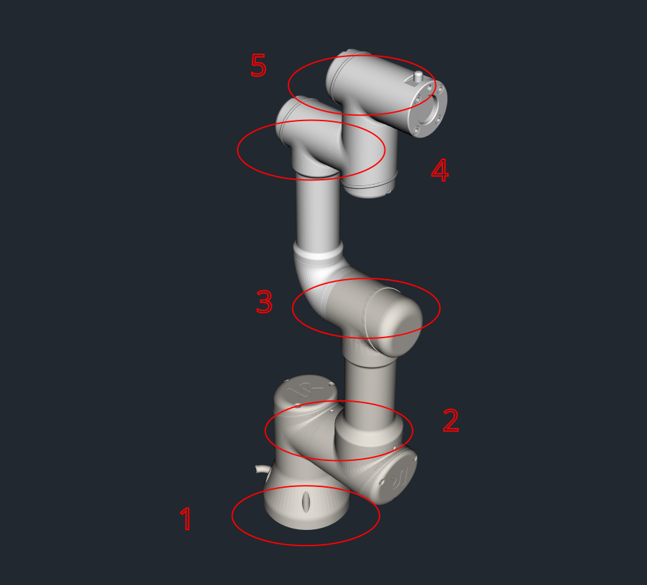

######################
MBDyn
######################

**********************
参考资料
**********************

网站为 `<https://www.mbdyn.org/>`_ ，在网站Documentation中有Tutorials，这个Tutorials有点简单。
《MBDyn Tutorials》和输入文件格式《MBDyn Input File Format Version develop》的pdf文件，保存在 ``FENGSim/starter/mbdyn`` 目录下。
还有一个日本公司的网站上有很多例子，见链接 `<https://www.sky-engin.jp/en/>`_ ，也有一个使用说明，见链接 `<https://www.sky-engin.jp/en/MBDynTutorial/index.html>`_ 。

**********************
编译安装
**********************

**********************
算例测试
**********************

在 ``FENGSim/starter/mbdyn/free_falling`` 目录下有一个自由落体的简单例子，运行如下命令。 ::
  
    cd FENGSim/starter/mbdyn/free_falling
    ./../../../toolkit/DAE/install/mbdyn_install/bin/mbdyn -f free_falling_body_E.mbd
    gnuplot
    plot 'free_falling_body_E.mov' using 3:4

.. image:: fig/mbdyn_1.png
   :scale: 50 %
   :alt: alternate text
   :align: center    

**********************
前后处理
**********************

=========================
前处理文件
=========================

前处理文件为.mbd配置文件和.stl几何模型文件，对Universal Robot公司的UR3机械臂，.stl几何模型文件、原始cad文件和UR3E尺寸详细文档都在 ``FENGSim/starter/mbdyn/robot/`` 路径下
，这里注意原始cad文件和UR3E尺寸详细文档中有一个尺寸是对不上的。

可以在 ``FENGSim/starter/mbdyn/robot/robot_arm.mbd`` 中设置5个关节角度，关节如下图。

在 ``FENGSim/starter/mbdyn/robot/robot_arm.mbd`` 中关节角度通过约束函数定义，如下内容中的scalar function。
scalar function是和时间相关的函数，关节角度可以随着时间变化。

将scalar function简化成固定角度，输入5个固定值，计算时长为2，对时间点2进行角度约束，对时间点1进行约束计算会不收敛。 ::

  #-----------------------------------------------------------------------------
  # Scalar Functions 
  scalar function: "Fun_Motor_JoTotp_Stage",
  multilinear,
      0.0, 0.0,
      1.0, 0.0,
      2.0, -1./2.*pi;

  scalar function: "Fun_Motor_JoTotj_Stage_UpperArm",
  multilinear,
      0.0, 0.0,
      1.0, 0.0,
      2.0, -2./6.*pi;
       
  scalar function: "Fun_Motor_JoTotj_UpperArm_LowerArm",
  multilinear,
      0.0, 0.0,
      1.0, 0.0,
      2.0, -4./6.*pi;
      
  scalar function: "Fun_Motor_JoTotj_LowerArm_Wrist",
  multilinear,
      0.0, 0.0,
      1.0, 0.0,
      2.0, 1./6.*pi;
      
  scalar function: "Fun_Motor_JoTotj_Wrist_Hand",
  multilinear,
      0.0, 0.0,
      1.0, 0.0,
      2.0, pi;

.. image:: fig/ur3e.gif
   :width: 640
   :alt: alternate text
   :align: center    

=========================
后处理文件
=========================

`<https://github.com/mmorandi/MBDyn-web/raw/main/userfiles/documents/tutorials.pdf>`_ 中第2.1节中介绍了结果文件格式，尤其是mov，如下。

The second file (mov) will contain Nnodes by Ntimesteps lines formatted as:

* the node label
* the three coordinates of the position of the node
* the three Euler-like angles that define the orientation of the node (following the 1, 2, 3 convention)
* the three components of the velocity of the node
* the three components of the angular velocity of the node

.. image:: fig/crank_slider.gif
   :width: 640
   :alt: alternate text
   :align: center
