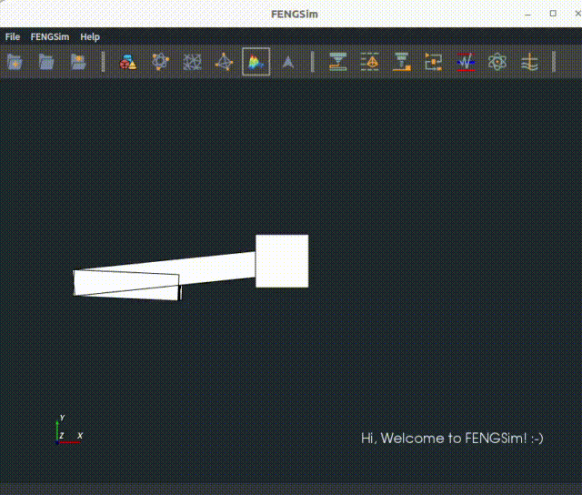
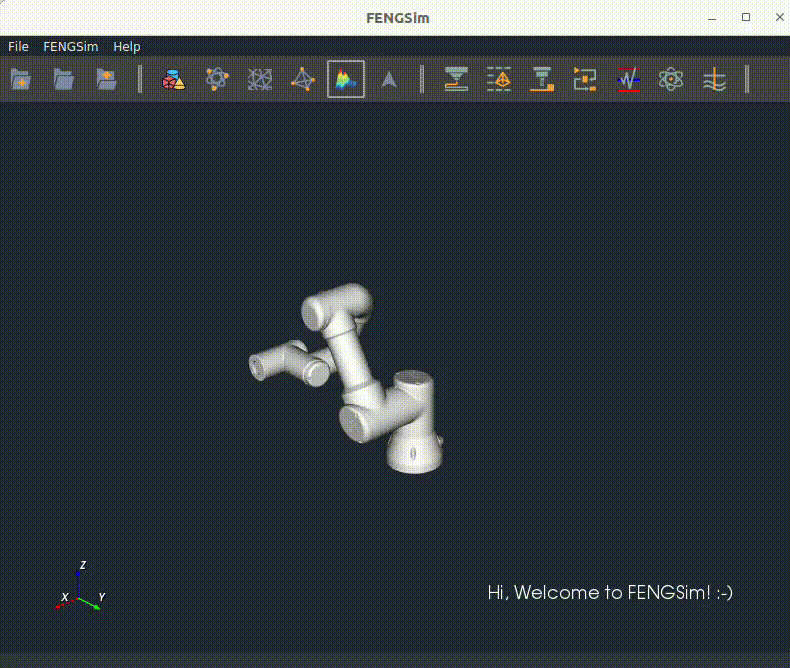

######################
MBDyn
######################

**********************
参考资料
**********************

网站为 `<https://www.mbdyn.org/>`_ ，在网站Documentation中有Tutorials，这个Tutorials有点简单。
《MBDyn Tutorials》和输入文件格式《MBDyn Input File Format Version develop》的pdf文件，保存在 ``FENGSim/starter/mbdyn`` 目录下。
还有一个日本公司的网站上有很多例子，见链接 `<https://www.sky-engin.jp/en/>`_ ，也有一个使用说明，见链接 `<https://www.sky-engin.jp/en/MBDynTutorial/index.html>`_ 。

**********************
编译安装
**********************

**********************
算例测试
**********************

在 ``FENGSim/starter/mbdyn/free_falling`` 目录下有一个自由落体的简单例子，运行如下命令。 ::
  
    cd FENGSim/starter/mbdyn/free_falling
    ./../../../toolkit/DAE/install/mbdyn_install/bin/mbdyn -f free_falling_body_E.mbd
    gnuplot
    plot 'free_falling_body_E.mov' using 3:4

.. image:: fig/mbdyn_1.png
   :scale: 50 %
   :alt: alternate text
   :align: center    

**********************
前后处理
**********************

`<https://github.com/mmorandi/MBDyn-web/raw/main/userfiles/documents/tutorials.pdf>`_ 中第2.1节中介绍了结果文件格式，尤其是mov，如下。

The second file (mov) will contain Nnodes by Ntimesteps lines formatted as:

* the node label
* the three coordinates of the position of the node
* the three Euler-like angles that define the orientation of the node (following the 1, 2, 3 convention)
* the three components of the velocity of the node
* the three components of the angular velocity of the node

   

