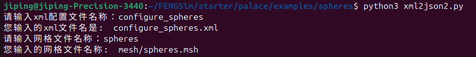
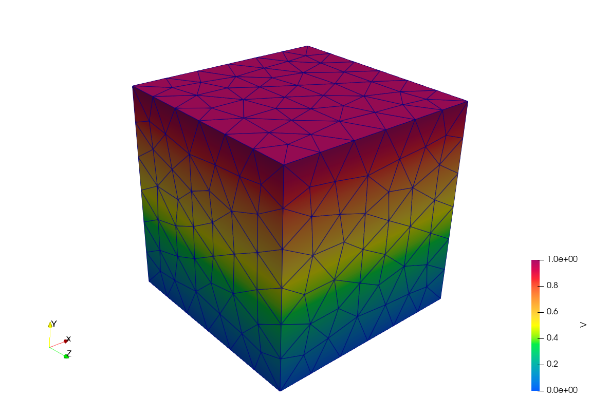

--------------------
xml转json
--------------------

在 ``FENGSim/starter/palace/examples/spheres/`` 路径下有两个python脚本，分别是xml2json.py和xml2json2.py，
xml2json.py是原封不动将xml中字典格式转换为json，xml2json2.py是将xml中网格组名称去掉后转换为json。
运行xml2json2.py，会要求从命令行输入xml文件名称和网格文件名称，名称不用输入后缀名，网格文件默认保存在 ``FENGSim/starter/palace/examples/spheres/mesh`` 路径下，
运行结果如下图，并生成data3.json文件。

在 ``FENGSim/starter/palace/examples/spheres/`` 路径下有两个例子，
一个是原始Palace给的电容矩阵例子，xml和msh文件名称分别为configure_spheres.xml和spheres.msh，这个例子中用了Ground和Terminal的边界条件，
另外一个是自定义的例子，xml和msh文件名称分别为configure_ex_3d.xml和ex_3d.msh，这个例子中测试了Ground、Terminal、ZeroCharge三种边界条件。
这两个例子测试了xml2json2.py。

